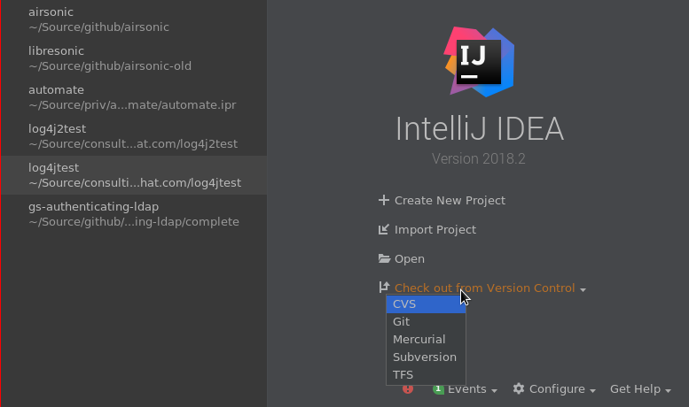
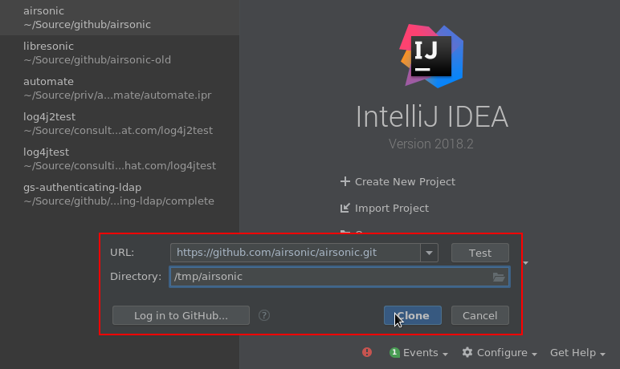
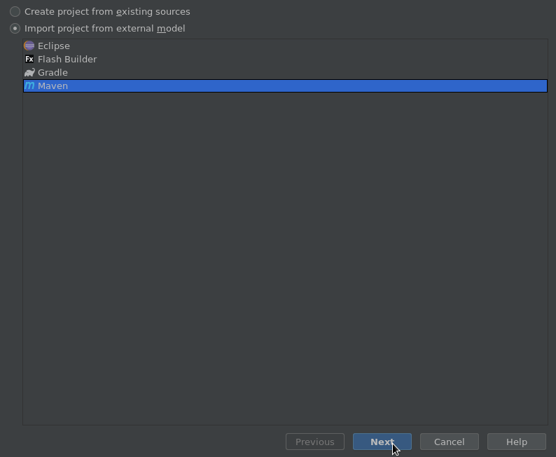
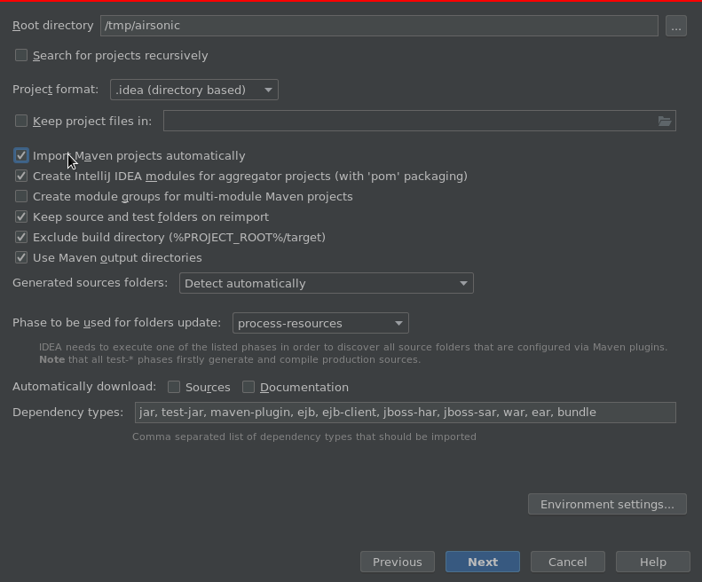
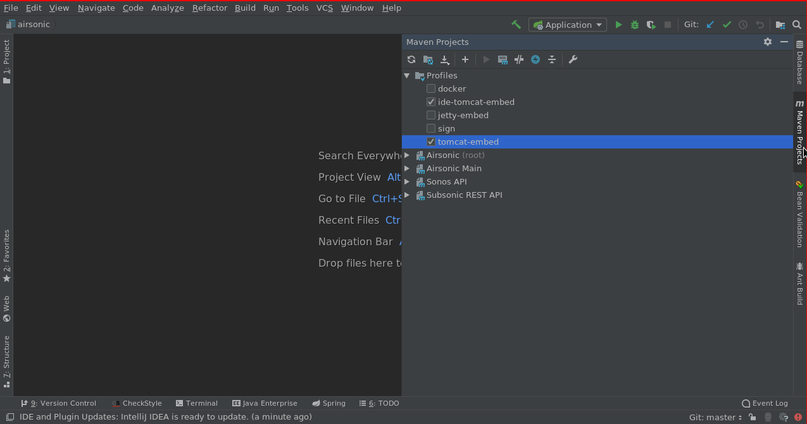
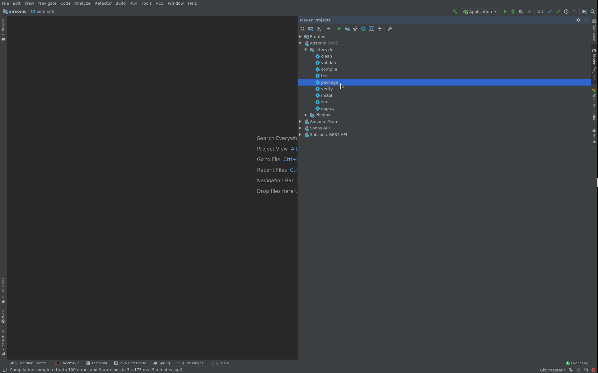
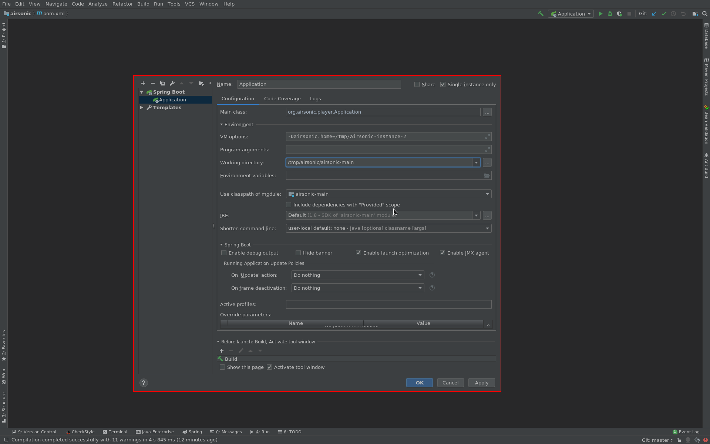
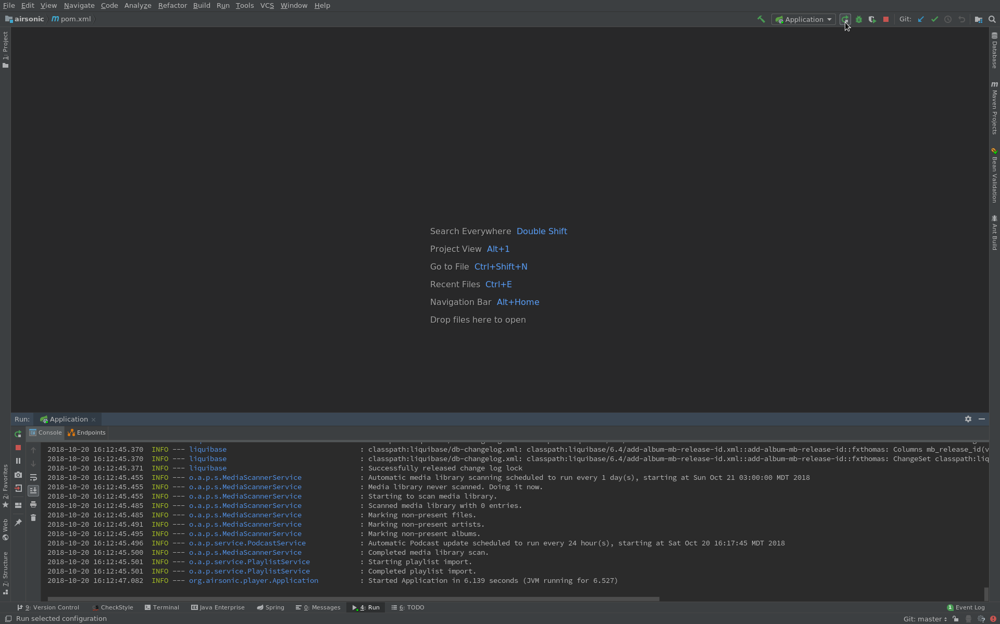

For developing with Intellij (running and debugging), there are two options listed below.

*Intellij Ultimate 2018.2 was used for these instructions. Intellij Community 2018.2 should work fine for the first option. The second requires Ultimate*

## Use embedded Spring Boot
1. In the new project dialog, click "Check out from Version Control":

2. Enter in the url for the airsonic source code, and click clone:

3. Import Project Using maven:

4. Check "Import Maven projects automatically" and click next:

5. In the remaining dialog boxes, the default options are fine. Click next through them. At this point you should see intellij load up.

6. At the right side of the window, expand "Maven Projects" and ensure both "ide-tomcat-embed" and "tomcat-embed" profiles are checked:

7. Expand the `Airsonic (root)` and Lifecycle tree and run `package`:

8. Edit the runtime profiles. There should already be a Spring Boot runtime profile called "Application". If not, create it by locating the `org.airsonic.player.Application` class and clicking the green play button next to the class name. Once it exists, expand the Environment section and ensure "Include dependencies with "Provided" scope is unchecked. Set the "Working directory" to the location of the `airsonic-main` subdirectory. Also if you want to change your `airsonic.home` do so now by adding `-Dairsonic.home=YOUR_DIRECTORY` to the VM options. Click "Ok".

9. Now you can run or debug the application:

## Use external Tomcat

**TODO**
